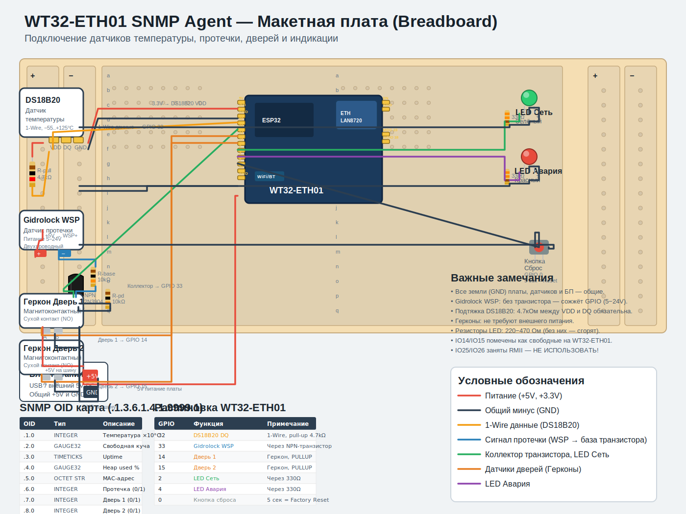

# SNMP Agent на базе WT32-ETH01

Мониторинг серверного помещения по SNMP v2c: температура, протечка воды, открытие дверей, удалённая смена сетевых настроек.

## Возможности

- **Температура** — DS18B20 по 1-Wire, опрос каждые 2 секунды
- **Протечка воды** — H2O-Контакт исп.1 через транзисторную развязку
- **Датчики дверей** — 2 геркона (сухой контакт)
- **Светодиодная индикация** — питание, сеть, авария
- **SNMP v2c** — стандартный MIB2 + кастомный enterprise MIB
- **Удалённая смена IP/шлюза/маски** — SNMP SET с валидацией и авто-перезагрузкой
- **Сброс к заводским** — удержание кнопки 5 секунд (стирает NVS)

## Список компонентов (BOM)

| Компонент | Количество | Примечание |
|-----------|-----------|------------|
| WT32-ETH01 | 1 | ESP32 + LAN8720 Ethernet |
| DS18B20 | 1 | Датчик температуры, 1-Wire, TO-92 |
| H2O-Контакт исп.1 | 1 | Двухпроводный датчик протечки |
| Геркон (магнитоконтактный) | 2 | NO, сухой контакт, для дверей |
| Транзистор NPN BC547 / 2N2222 | 1 | Развязка датчика протечки |
| Резистор 4.7 кОм | 1 | Подтяжка DS18B20 (VDD ↔ DQ) |
| Резистор 10 кОм | 2 | База транзистора + стягивание базы к GND |
| Резистор 330 Ом | 2 | Токоограничение светодиодов |
| Светодиод зелёный | 1 | Индикатор «Сеть» |
| Светодиод красный | 1 | Индикатор «Авария» |
| Кнопка тактовая | 1 | Сброс настроек (GPIO 5) |
| Блок питания 5V | 1 | Питание платы и датчиков |
| Макетная плата + провода | — | Для сборки |

## Схема подключения



Открыть в браузере: `Fritzing/breadboard_wiring.svg`

### Распиновка

| GPIO | Функция | Тип | Примечание |
|------|---------|-----|------------|
| 32 | DS18B20 DQ | INPUT | 1-Wire данные, pull-up 4.7кОм к 3.3V |
| 33 | H2O Протечка | INPUT_PULLUP | Через NPN-транзистор |
| 14 | Дверь 1 | INPUT_PULLUP | Геркон: замкнут на GND = закрыта |
| 15 | Дверь 2 | INPUT_PULLUP | Геркон: замкнут на GND = закрыта |
| 2 | LED Сеть | OUTPUT | Через резистор 330Ω |
| 4 | LED Авария | OUTPUT | Через резистор 330Ω |
| 5 | Кнопка сброса | INPUT_PULLUP | 5 сек = factory reset |
| 16 | CLK 50MHz | OUTPUT | Внешний осциллятор для LAN8720 |
| 23 | MDC | — | RMII (занят Ethernet) |
| 18 | MDIO | — | RMII (занят Ethernet) |

## Логика работы датчиков

### DS18B20 (температура)

Питание 3.3V, данные по 1-Wire на GPIO 32. Между VDD и DQ обязателен резистор 4.7 кОм. Значение публикуется в SNMP как `INTEGER` (температура × 10).

### H2O-Контакт (протечка)

Датчик питается от 5V. Без воды — ток не течёт, база транзистора притянута к GND резистором 10 кОм, транзистор закрыт, на GPIO 33 — логическая 1 (PULLUP). При протечке вода замыкает контакты, ток через резистор базы 10 кОм открывает транзистор, GPIO замыкается на GND — логический 0.

> [!CAUTION]
> Никогда не подключайте H2O-Контакт напрямую к GPIO! Напряжение шлейфа 5–24V сожжёт порт. Только через транзистор.

### Герконы (двери)

Дверь закрыта: магнит рядом, геркон замкнут, GPIO → GND = 0. Дверь открыта: геркон разомкнут, GPIO → PULLUP = 1. Внешнее питание не требуется. SNMP возвращает 1 при открытии (тревога).

## Сборка и прошивка

### Требования

- ESP-IDF v5.0 или новее
- LWIP с поддержкой SNMP (`LWIP_SNMP=1`)

```bash
# Клонирование
git clone https://github.com/AlekseyFedorov/snmp_agent_eth01.git
cd snmp_agent_eth01

# Настройка
idf.py set-target esp32
idf.py menuconfig  # Проверить LWIP → SNMP = y, Flash size = 4 MB

# Сборка и прошивка
idf.py build
idf.py -p COM3 flash monitor
```

### Параметры по умолчанию

| Параметр | Значение |
|----------|---------|
| IP-адрес | 192.168.2.50 |
| Шлюз | 192.168.2.1 |
| Маска | 255.255.255.0 |
| SNMP Read | public |
| SNMP Write | private |

## SNMP-команды

Базовый OID: `.1.3.6.1.4.1.9999.1`

### Чтение (GET)

```bash
# Температура (×10°C)
snmpget -v 2c -c public 192.168.2.50 .1.3.6.1.4.1.9999.1.1.0

# Протечка (0 — сухо, 1 — протечка)
snmpget -v 2c -c public 192.168.2.50 .1.3.6.1.4.1.9999.1.6.0

# Дверь 1 (0 — закрыта, 1 — открыта)
snmpget -v 2c -c public 192.168.2.50 .1.3.6.1.4.1.9999.1.7.0

# Дверь 2
snmpget -v 2c -c public 192.168.2.50 .1.3.6.1.4.1.9999.1.8.0

# Пройти всё дерево
snmpwalk -v 2c -c public 192.168.2.50 .1.3.6.1.4.1.9999.1
```

### Запись (SET) — смена сети

```bash
# Одним пакетом (рекомендуется):
snmpset -v 2c -c private 192.168.2.50 \
  .1.3.6.1.4.1.9999.1.10.0 s "192.168.2.55" \
  .1.3.6.1.4.1.9999.1.11.0 s "192.168.2.1" \
  .1.3.6.1.4.1.9999.1.12.0 s "255.255.255.0"
```

После записи устройство перезагрузится через 1 секунду.

### Полная OID-карта

| OID | Тип | Доступ | Описание |
|-----|-----|--------|----------|
| .1.0 | INTEGER | RO | Температура ×10°C |
| .2.0 | GAUGE32 | RO | Свободная heap-память (байт) |
| .3.0 | TIMETICKS | RO | Uptime (×10 мс) |
| .4.0 | GAUGE32 | RO | Использовано heap % |
| .5.0 | OCTET STRING | RO | MAC-адрес (6 байт) |
| .6.0 | INTEGER | RO | Протечка воды (0 — сухо, 1 — тревога) |
| .7.0 | INTEGER | RO | Дверь 1 (0 — закрыта, 1 — открыта) |
| .8.0 | INTEGER | RO | Дверь 2 (0 — закрыта, 1 — открыта) |
| .10.0 | OCTET STRING | RW | IP-адрес |
| .11.0 | OCTET STRING | RW | Шлюз |
| .12.0 | OCTET STRING | RW | Маска подсети |

## Индикация

| Светодиод | GPIO | Логика |
|-----------|------|--------|
| LED Сеть (зелёный) | IO2 | Горит — сеть активна |
| LED Авария (красный) | IO4 | Горит при: протечке, открытой двери, t > 45°C |

## Структура проекта

```
snmp_agent_eth01/
├── main/
│   ├── main.c              # SNMP-агент, дерево MIB, задачи FreeRTOS
│   ├── ethernet_app.c/h    # Инициализация Ethernet, статический IP
│   ├── sensors_app.c/h     # Драйверы датчиков (DS18B20, H2O, герконы)
│   └── CMakeLists.txt      # Сборка компонентов
├── Fritzing/
│   └── breadboard_wiring.svg  # Схема макетной платы
├── CMakeLists.txt          # Корневой сборочный файл ESP-IDF
├── sdkconfig               # Конфигурация проекта
└── README.md
```

---

## Мой вариант улучшения проекта

### 1. Замена DS18B20 на DHT22 / BME280

DS18B20 даёт только температуру. **DHT22** (GPIO, I2C) добавляет влажность — критично для серверной. **BME280** (I2C) даёт температуру + влажность + атмосферное давление. Рекомендую BME280: точнее DS18B20, не требует pull-up мастера на шине, уже есть готовый ESP-IDF компонент `espressif/bme280`.

Добавить OID:
- `.9.0` — Влажность ×10 (%)
- `.13.0` — Давление ×10 (гПа)

### 2. Замена транзистора на оптрон (PC817)

Транзисторная развязка работает, но при пробое транзистора 5V попадает на GPIO 33. **Оптрон PC817** даёт гальваническую развязку — напряжение шлейфа (до 24V) физически изолировано от ESP32. Схема: H2O(+) → резистор 1кОм → анод оптрона → катод → H2O(-). Коллектор оптрона → GPIO 33, эмиттер → GND.

### 3. Добавить зуммер (Buzzer)

Пассивный пьезоизлучатель на GPIO 5 через транзисторный ключ. Локальная звуковая сигнализация при аварии. Полезно, если персонал находится рядом, а мониторинг ещё не заметил тревогу.

### 4. Добавить SNMP Trap

Сейчас агент только отвечает на GET/SET. SNMP Trap позволит активно уведомлять NMS (Zabbix/PRTG) о событиях:
- Протечка (`.6.0` изменился на 1)
- Дверь открыта (`.7.0` или `.8.0` изменился на 1)
- Температура выше порога (конфигурируемый OID `.14.0`)

### 5. Watchdog аппаратный

Добавить `esp_task_wdt` для автоматической перезагрузки при зависании опроса датчиков или сетевого стека.

### 6. mDNS для авто-обнаружения

Добавить `esp_mdns` — устройство будет видно в сети как `snmp-agent.local`. Не нужно помнить IP.

---

## Лицензия

MIT. См. [LICENSE](LICENSE).
