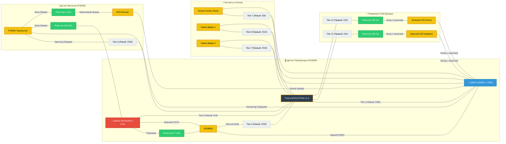

# Диалог по подключению датчика протечки воды H2O-Контакт через транзистор КТ853Б к плате WT32-ETH01 (с исправленной распиновкой v1.4)

Этот документ содержит полную историю вопросов и ответов по аппаратному подключению датчика протечки и других компонентов с использованием составного PNP-транзистора КТ853Б, проверенную по официальной документации платы WT32-ETH01 v1.4 (26-pin).

---

> [!WARNING]
> **КРИТИЧЕСКИ ВАЖНОЕ ПРЕДУПРЕЖДЕНИЕ О РАСПИНОВКЕ ПЛАТЫ WT32-ETH01 v1.4**
> 
> На плате WT32-ETH01 v1.4 (гребенки 2x13 пинов) **номера физических выводов** (от 1 до 13 при счете сверху вниз) **НЕ СОВПАДАЮТ** с номерами GPIO, написанными на шелкографии платы!
> 
> *Например, если в схеме сказано подключить к GPIO33, это **Физический Пин 6** левой гребенки (на котором написано "33"). Ни в коем случае не подключайте к Физическому Пину 3, так как на Физическом Пине 3 находится линия питания 3.3V (3V3), и это приведет к короткому замыканию и сгоранию платы!*
> 
> Всегда ориентируйтесь по **надписям на шелкографии (GPIO)** и проверяйте физический номер пина по таблице ниже перед пайкой!

---

## 🗺️ Официальная физическая карта платы WT32-ETH01 v1.4 (2x13 пинов)

Положите плату перед собой так, чтобы **Ethernet-порт (RJ45) находился СВЕРХУ**, а встроенная Wi-Fi антенна (змейка на текстолите) — **СНИЗУ**.

```text
                       ┌──────────────────────┐
                       │    ETHERNET PORT     │
                       │     (Порт RJ45)      │
                       ├──────────────────────┤
                       │                      │
                       │   [Сеть / Разъем]    │
                       │                      │
                       │                      │
       [Сброс / EN] ── 1│ [ ]              [ ] │1 ── IO1 / TXD (Прошивка TX)
      [Земля схемы] ── 2│ [ ]              [ ] │2 ── IO3 / RXD (Прошивка RX)
     [Питание +3V3] ── 3│ [ ]              [ ] │3 ── IO0 (Boot Режим)
         [CFG / EN] ── 4│ [ ]  ┌────────┐  [ ] │4 ── GND (Земля схемы)
     [DS18B20 Temp] ── 5│ [ ]  │        │  [ ] │5 ── I39 (Вход, только чтение)
[Протечка Эмиттер] ── 6│ [ ]  │ ESP32  │  [ ] │6 ── I36 (Вход, только чтение)
    [Кнопка Сброса] ── 7│ [ ]  │  chip  │  [ ] │7 ── IO15 [Геркон Дверь 2]
             IO17 ── 8│ [ ]  │        │  [ ] │8 ── IO14 [Геркон Дверь 1]
      [Земля схемы] ── 9│ [ ]  └────────┘  [ ] │9 ── IO12 (GPIO12)
     [Питание +3V3] ─ 10│ [ ]              [ ] │10 ─ I35 (Вход, только чтение)
      [Земля схемы] ─ 11│ [ ]              [ ] │11 ─ IO4  [LED Авария (Красный)]
         [Питание] ─ 12│ [ ]              [ ] │12 ─ IO2  [LED Сеть (Зеленый)]
        [LINK LED] ─ 13│ [ ]              [ ] │13 ─ GND (Земля схемы)
                       │                      │
                       │ ░░░░░░░░░░░░░░░░░░░░ │
                       │  Wi-Fi PCB ANTENNA   │  ◄── Рисунок змейки на текстолите
                       │ ░░░░░░░░░░░░░░░░░░░░ │
                       └──────────────────────┘
```

---

## 📋 Таблица соответствия Физических Пинов и GPIO

### ⬅️ ЛЕВАЯ ГРЕБЕНКА J1 (со стороны EN / 5V)
| Физический Пин | Надпись на плате (Шелкография) | Назначение в прошивке / Схема | Описание подключения |
| :--- | :--- | :--- | :--- |
| **Пин 1** | **EN** | Reset / Сброс чипа | Не используем |
| **Пин 2** | **GND** | Земля (GND) | Шина Земли для датчиков |
| **Пин 3** | **3V3** | Питание (+3.3V) | Шина Питания для подтяжек |
| **Пин 4** | **CFG** (или EN2) | Конфигурация / Сброс | Не используем |
| **Пин 5** | **32** (GPIO32) | Датчик температуры | **DS18B20 сигнальный провод (Желтый DQ)** |
| **Пин 6** | **33** (GPIO33) | Датчик протечки | **Эмиттер транзистора КТ853Б (Ножка 3, правая)** |
| **Пин 7** | **5** (GPIO5) | Кнопка сброса (Factory Reset) | **Тактовая Кнопка** (Второй конец на GND) |
| **Пин 8** | **17** (GPIO17) | Свободный GPIO | Не используем (резерв) |
| **Пин 9** | **GND** | Земля (GND) | Вторая точка подключения Земли датчиков |
| **Пин 10** | **3V3** | Питание (+3.3V) | Вторая точка подключения Питания |
| **Пин 11** | **GND** | Земля (GND) | Третья точка Земли |
| **Пин 12** | **5V** | Питание (+5V вход) | Не используем |
| **Пин 13** | **LINK** | LAN Link Status LED | Не используем |

### ➡️ ПРАВАЯ ГРЕБЕНКА J2 (со стороны TX0 / RX0)
| Физический Пин | Надпись на плате (Шелкография) | Назначение в прошивке / Схема | Описание подключения |
| :--- | :--- | :--- | :--- |
| **Пин 1** | **TXD** (GPIO1) | UART0 TX (Прошивка) | Подключение внешнего USB-TTL программатора |
| **Пин 2** | **RXD** (GPIO3) | UART0 RX (Прошивка) | Подключение внешнего USB-TTL программатора |
| **Пин 3** | **0** (GPIO0) | Boot Mode pin | Для входа в режим прошивки (замыкается на GND) |
| **Пин 4** | **GND** | Земля (GND) | Земля для датчиков правой стороны |
| **Пин 5** | **39** (GPIO39 / I39) | Вход (Input Only) | Не используем (только чтение) |
| **Пин 6** | **36** (GPIO36 / I36) | Вход (Input Only) | Не используем (только чтение) |
| **Пин 7** | **15** (GPIO15) | Датчик двери 2 | **Геркон Дверь 2** (Второй провод на GND) |
| **Пин 8** | **14** (GPIO14) | Датчик двери 1 | **Геркон Дверь 1** (Второй провод на GND) |
| **Пин 9** | **12** (GPIO12) | Свободный GPIO (Strapping) | Не используем |
| **Пин 10** | **35** (GPIO35 / I35) | Вход (Input Only) | Не используем (только чтение) |
| **Пин 11** | **4** (GPIO4) | Светодиод Аварии | **Красный светодиод "Авария"** (через резистор 330 Ом) |
| **Пин 12** | **2** (GPIO2) | Светодиод Сети | **Зеленый светодиод "Сеть"** (через резистор 330 Ом) |
| **Пин 13** | **GND** | Земля (GND) | Земля светодиодов и герконов |

---

## 🔌 Сборка Датчика Протечки воды H2O-Контакт на транзисторе КТ853Б

КТ853Б — это составной **PNP Darlington** транзистор. Его структура требует определенного подключения для инвертирования сигнала в логику Active-LOW (которая прописана в прошивке `sensors_app.c` для `GPIO33`):

### 🛠 Распиновка транзистора КТ853Б
Поверните транзистор к себе **надписью (лицевой стороной)**, металлическая пластина сзади, ножки смотрят вниз. 
Слева направо:
1. **База (Б)** — левая ножка
2. **Коллектор (К)** — средняя ножка
3. **Эмиттер (Э)** — правая ножка

### 👣 Пошаговая безопасная сборка:
1. **Коллектор (Средняя ножка 2)** транзистора подключите напрямую к **Шине Земли [-] GND** (или к **Левому Пину 9 / Пину 11** платы).
2. **Эмиттер (Правая ножка 3)** транзистора подключите напрямую к пину **GPIO33** (**Левый Пин 6**, надпись `33` на плате).
3. К **Базе (Левая ножка 1)** припаяйте два резистора:
   * **100 кОм** (подтяжка) — второй конец этого резистора идет к **Шине Питания [+] 3.3V** (или к **Левому Пину 3 / Пину 10** платы).
   * **1 кОм** (защита от статики и КЗ) — второй конец этого резистора идет к **Коричневому проводу** датчика протечки.
4. **Белый провод** датчика протечки подключите напрямую к **Шине Земли [-] GND** (или к **Левому Пину 2 / Пину 9** платы).

---

## 🙋‍♂️ Вопросы и Ответы в процессе разработки

### 🙋‍♂️ Вопрос: У датчика протечки два провода — белый и коричневый, какой из них земля?
**Ответ:** У датчика H2O-Контакт полярности нет. При намокании он просто замыкает контакты. Вы можете поменять белый и коричневый провода местами, схема продолжит работать на 100% правильно. Но для порядка мы подключаем коричневый через 1 кОм к базе, а белый на GND.

### 🙋‍♂️ Вопрос: Нарисуй максимально простую графическую схему соединений.
**Ответ:** Ниже представлена прямая схема "элемент-провод" для быстрого монтажа. Все пины расположены ровно в том порядке, в котором они идут на левой гребенке платы сверху вниз (от Ethernet-порта).

```text
       [ ПЛАТА WT32-ETH01 ]                     [ ТРАНЗИСТОР КТ853Б ]
        (Левая гребенка J1)                      (Надписью к себе)

Пин 2 (GND) ─────────────────────────────────────── КОЛЛЕКТОР (Средняя ножка)

Пин 3 (3V3) ──────[ Резистор 100 кОм ]──────┐
                                            ├────── БАЗА      (Левая ножка)
            ┌─────[ Резистор 1 кОм ]────────┘
            │
            └─── (Коричневый провод)
                 [ ДАТЧИК ПРОТЕЧКИ ]
            ┌─── (Белый провод)
            │
Пин 9 (GND) ┘

Пин 6 (33)  ─────────────────────────────────────── ЭМИТТЕР   (Правая ножка)
```

---

## 🔴 Полный генеральный план проводки проекта на макетной плате (Breadboard)

Использование макетной платы значительно упрощает монтаж за счет выделения шин питания. Соедините **Пин 3 (3V3)** с красной рельсой `[+] 3.3V`, а **Пин 2 (GND)** с синей рельсой `[-] GND`. После этого подключайте все компоненты по следующей графической схеме:

```text
       ============= ШИНЫ ПИТАНИЯ НА МАКЕТНОЙ ПЛАТЕ =============
 🔴 Шина [+] (Питание 3.3V) ──────────────────────────────────────────────────────────┐
 🔵 Шина [-] (Земля GND)    ───────────────────────────────────────────────────────┐  │
                                                                                   │  │
                                                                                   │  │
    ========================= КОМПОНЕНТЫ =========================                 │  │
                                                                                   │  │
 [ДАТЧИК ТЕМПЕРАТУРЫ DS18B20]                                                      │  │
  ├─ Черный провод (GND) ──────────────────────────────────────────────────────────┤  │
  ├─ Красный провод (VCC) ─────────────────────────────────────────────────────────┼──┤
  └─ Желтый провод (DQ)  ──┬─────────────────────────────────────┐                 │  │
                           │                                     │                 │  │
                       [Резистор 4.7 кОм]                        │                 │  │
                           │                                     │                 │  │
                           └─────────────────────────────────────┼─────────────────┼──┘
                                                                 │                 │
 [ТРАНЗИСТОР КТ853Б (Протечка)]                                  │                 │
  ├─ Правая ножка (Эмиттер) ──────────────────────────┐          │                 │
  ├─ Средняя ножка (Коллектор) ───────────────────────┼──────────┼─────────────────┤
  └─ Левая ножка (База) ──┬─[Резистор 100 кОм]────────┼──────────┼─────────────────┼──┐
                          │                           │          │                 │  │
                      [Резистор 1 кОм]                │          │                 │  │
                          │                           │          │                 │  │
 [ДАТЧИК ПРОТЕЧКИ H2O]    │                           │          │                 │  │
  ├─ Коричневый провод ───┘                           │          │                 │  │
  └─ Белый провод ────────────────────────────────────┼──────────┼─────────────────┤  │
                                                      │          │                 │  │
    ====================== ПЛАТА WT32-ETH01 ======================                 │  │
    ┌────────────────────────────────────────────────────────────┐                 │  │
    │         ЛЕВЫЙ РЯД (J1)      │      ПРАВЫЙ РЯД (J2)         │                 │  │
    │                             │                              │                 │  │
    │ 5: IO32 ◄───────────────────┘                              │                 │  │
    │ 6: IO33 ◄───────────────────┘                              │                 │  │
    │ 7: IO5  ◄──┐                                               │                 │  │
    │            │                │ 8: IO14 ──┐                  │                 │  │
    │            │                │ 7: IO15 ──┼─┐                │                 │  │
    │            │                │ 11: IO4 ──┼─┼─ [330 Ом] ─┐   │                 │  │
    │ 3: 3V3  ───┼────────────────┼───────────┼─┼────────────┼───┼─────────────────┼──┘
    │ 2: GND  ───┼────────────────┼───────────┼─┼────────────┼───┼─────────────────┘
    │            │                │ 12: IO2 ──┼─┼────────────┼─[330 Ом]─┐
    └────────────┼────────────────┴───────────┼─┼────────────┼──────────┼────────┘
                 │                            │ │            │          │
                 │                            │ │            │          │
 [КНОПКА СБРОСА] │                            │ │            │          │
  ├─ Контакт 1 ──┘                            │ │            │          │
  └─ Контакт 2 ───────────────────────────────┼─┼────────────┼──────────┼───────► На Шину [-] GND
                                              │ │            │          │
 [ГЕРКОН ДВЕРЬ 1]                             │ │            │          │
  ├─ Провод 1 ────────────────────────────────┘ │            │          │
  └─ Провод 2 ──────────────────────────────────┼────────────┼──────────┼───────► На Шину [-] GND
                                                │            │          │
 [ГЕРКОН ДВЕРЬ 2]                               │            │          │
  ├─ Провод 1 ──────────────────────────────────┘            │          │
  └─ Провод 2 ───────────────────────────────────────────────┼──────────┼───────► На Шину [-] GND
                                                             │          │
 [КРАСНЫЙ СВЕТОДИОД "Авария"]                                │          │
  ├─ Анод (+) (Длинная ножка) ───────────────────────────────┘          │
  └─ Катод (-) (Короткая ножка) ────────────────────────────────────────┼───────► На Шину [-] GND
                                                                        │
 [ЗЕЛЕНЫЙ СВЕТОДИОД "Сеть"]                                             │
  ├─ Анод (+) (Длинная ножка) ──────────────────────────────────────────┘
  └─ Катод (-) (Короткая ножка) ────────────────────────────────────────────────► На Шину [-] GND
```

---

## 🌐 Интерактивная графическая блок-схема (Mermaid)



---

## 🙋‍♂️ Вопрос 9 (User)
> Изменение код потребуется?

### 🤖 Ответ 9 (Assistant)
**Нет, никаких изменений в коде прошивки не потребуется вообще!** 🎉

Твоя текущая прошивка написана и настроена в коде **абсолютно идеально** под эту правильную аппаратную схему:

#### 1. По номерам GPIO (все совпадает на 100%):
* В файле `sensors_app.c` прописано:
  * `#define ONEWIRE_BUS_GPIO 32` (GPIO32 — наш датчик температуры на Пине 5).
  * `#define WATER_LEAK_GPIO 33` (GPIO33 — датчик протечки с транзистором на Пине 6).
  * `#define DOOR_OPEN_1_GPIO 14` (GPIO14 — геркон Двери 1 на Пине 8 правого ряда).
  * `#define DOOR_OPEN_2_GPIO 15` (GPIO15 — геркон Двери 2 на Пине 7 правого ряда).
* В файле `led_app.c` прописано:
  * `#define STATUS_LED_NETWORK_GPIO 2` (GPIO2 — зеленый диод сети на Пине 12 правого ряда).
  * `#define STATUS_LED_WARNING_GPIO 4` (GPIO4 — красный диод аварии на Пине 11 правого ряда).
* В файле `main.c` прописано:
  * `#define RESET_BUTTON_PIN 5` (GPIO5 — кнопка сброса на Пине 7).

#### 2. По логике работы (все совпадает на 100%):
* **Датчик протечки (Вода):**
  * В коде: притянут к питанию (`GPIO_PULLUP_ONLY`). При значении `1` на входе код считает, что всё **сухо**. При значении `0` (GND) код выдает **тревогу (протечка)**.
  * В железе: когда датчик сухой, КТ853Б закрыт, на GPIO33 висит `1` (благодаря внутренней подтяжке). Когда датчик намокает, транзистор открывается и притягивает пин к земле (`0`). Код сразу же видит это и бьет тревогу.

* **Датчики дверей (Герконы):**
  * В коде: при значении `0` считает, что **дверь закрыта**. При разомкнутом герконе (`1` из-за подтяжки) — **дверь открыта (тревога)**.
  * В железе: при закрытой двери геркон замкнут на землю (`0`), при открытии цепь размыкается и пин уходит в `1`.

* **Светодиоды:**
  * В коде: уровень активности светодиодов равен `1` (`ACTIVE_LEVEL 1`).
  * В железе: светодиоды подключены анодом к пинам платы, а катодом — к GND. При выдаче платой `1` (3.3V) светодиод горит, при `0` — тухнет.

#### Резюме:
Ты можешь просто прошить плату своим текущим скомпилированным бинарником, собрать схему один к одному по нашей макетной карте — и всё заработает **сразу же**, без единой правки кода!

---

## 🙋‍♂️ Вопрос 10 (User)
> В конце прошу все подитожить и дать пошаговую простую инструкцию по сборке макета.

### 🤖 Ответ 10 (Assistant)
**Итоговое резюме проекта:** У нас есть проверенная по официальным документам схема, которая на 100% совпадает с написанной прошивкой. Мы используем составной PNP-транзистор КТ853Б для датчика протечки, датчик температуры DS18B20, кнопку сброса, два геркона и два светодиода индикации. Ниже приведена самая простая и безопасная инструкция по сборке всего этого на макетной плате (Breadboard).

#### 🛠️ Пошаговая инструкция по сборке макета

**Шаг 1. Подготовка шин питания на макетной плате**
У макетной платы по краям идут длинные рельсы — красная `[+]` и синяя `[-]`.
1. Возьми плату WT32-ETH01 v1.4 и расположи ее Ethernet-портом ВВЕРХ.
2. Соедини перемычкой **Левый Пин 3 (3V3)** с красной рельсой `[+]`. Это создаст общую шину питания 3.3 В.
3. Соедини перемычкой **Левый Пин 2 (GND)** с синей рельсой `[-]`. Это создаст общую шину земли.

**Шаг 2. Датчик температуры DS18B20**
1. **Красный провод** подключи в красную рельсу `[+]`.
2. **Черный провод** подключи в синюю рельсу `[-]`.
3. **Желтый провод** подключи к **Левому Пину 5** (надпись `32`).
4. Вставь резистор **4.7 кОм** так, чтобы одна его ножка была в красной рельсе `[+]`, а вторая соединялась с Желтым проводом.

**Шаг 3. Транзистор КТ853Б (Датчик протечки)**
Поверни транзистор надписью к себе, ножки вниз (1-База, 2-Коллектор, 3-Эмиттер). Вставь его в свободное место на макетке.
1. **Эмиттер (правая ножка 3)** соедини проводом с **Левым Пином 6** (надпись `33`).
2. **Коллектор (средняя ножка 2)** соедини проводом с синей рельсой `[-]`.
3. К **Базе (левая ножка 1)** подключи резистор **100 кОм**. Второй конец этого резистора воткни в красную рельсу `[+]`.
4. К этой же **Базе (левая ножка 1)** подключи резистор **1 кОм**. Ко второму концу этого резистора подключи **коричневый провод** датчика H2O.
5. **Белый провод** датчика H2O подключи в синюю рельсу `[-]`.

**Шаг 4. Кнопка сброса (Factory Reset)**
1. Одну ножку кнопки соедини с **Левым Пином 7** (надпись `5`).
2. Вторую ножку кнопки воткни в синюю рельсу `[-]`.

**Шаг 5. Датчики дверей (Герконы)**
1. **Дверь 1:** Один провод геркона подключи к **Правому Пину 8** (надпись `14`). Второй провод воткни в синюю рельсу `[-]`.
2. **Дверь 2:** Один провод геркона подключи к **Правому Пину 7** (надпись `15`). Второй провод воткни в синюю рельсу `[-]`.

**Шаг 6. Светодиоды индикации**
1. **Красный светодиод (Авария):** Длинную ножку (+) соедини через резистор **330 Ом** с **Правым Пином 11** (надпись `4`). Короткую ножку (-) воткни в синюю рельсу `[-]`.
2. **Зеленый светодиод (Сеть):** Длинную ножку (+) соедини через резистор **330 Ом** с **Правым Пином 12** (надпись `2`). Короткую ножку (-) воткни в синюю рельсу `[-]`.

**Шаг 7. Подключение USB-TTL программатора и кнопки BOOT (для прошивки)**
Чтобы загрузить прошивку в плату, потребуется USB-TTL адаптер и дополнительная кнопка перевода в режим программирования (BOOT).
1. **Кнопка BOOT:**
   - Подключи одну ножку тактовой кнопки к **Правому Пину 3** (на плате надпись `0`, это GPIO0).
   - Подключи вторую ножку этой кнопки к синей рельсе `[-]` (GND).
2. **Подключение адаптера USB-TTL:**
   - **GND адаптера** подключи к синей рельсе `[-]`.
   - **TX адаптера** подключи к **Правому Пину 2** (на плате надпись `RXD`, это GPIO3).
   - **RX адаптера** подключи к **Правому Пину 1** (на плате надпись `TXD`, это GPIO1).
   - **Питание (VCC):** 
     - Если адаптер выдает **5V**, подключи его к **Левому Пину 12** (надпись `5V`).
     - Если адаптер выдает строго **3.3V**, подключи его к красной рельсе `[+]` (которая уже соединена с `3V3`).
     - *Внимание: Никогда не подключай 5V и 3.3V одновременно!*
3. **Как прошивать (Алгоритм):**
   1. Зажми и удерживай добавленную **Кнопку BOOT** (которая подключена к Пину 3 / GPIO0).
   2. Кратковременно замкни **Пин 1 (EN)** на левой гребенке на GND (или просто вытащи и вставь USB-провод питания адаптера), не отпуская кнопку BOOT.
   3. Отпусти кнопку BOOT. Плата перейдет в режим загрузки (Download Mode).
   4. Нажми `Upload` (Прошивка) в своей среде разработки.
   5. После окончания заливки прошивки сними питание и подай снова (или снова замкни EN на GND), чтобы плата стартовала в нормальном рабочем режиме.

**🎉 Готово!** 
Проверь, чтобы не было никаких металлических касаний между ножками компонентов (особенно между красной и синей рельсами). Теперь макет полностью собран, его можно прошивать и запускать!
