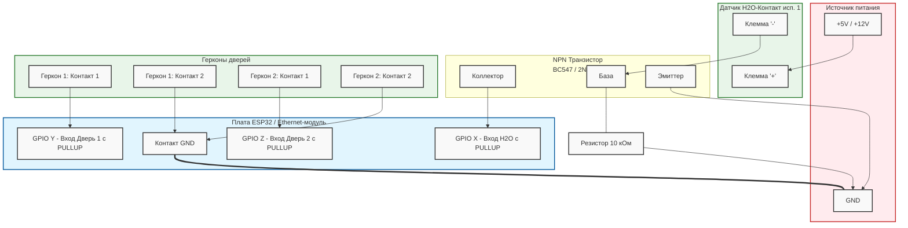

# Схема подключения датчиков к ESP32

## Датчик протечки H2O-Контакт исп. 1 (Двухпроводный)

Датчик H2O-Контакт исп. 1 при попадании воды изменяет свое сопротивление (увеличивает потребляемый ток). Поскольку он питается от напряжения 5-24В, а ESP32 работает с логикой 3.3В, напрямую подключать его к GPIO нельзя. 

Для согласования уровней и безопасного подключения используется простейшая схема на базе **NPN транзистора** (например, 2N2222, BC547, C945) и подтягивающего к земле резистора (Pull-down).

### Логика работы
1. **Сухо:** Ток через датчик практически не идет. База транзистора притянута к земле через резистор 10 кОм. Транзистор закрыт. На пине ESP32 за счет внутренней подтяжки (INPUT_PULLUP) формируется логическая **1 (HIGH)**.
2. **Протечка:** Вода замыкает контакты датчика, ток возрастает, напряжение на резисторе 10 кОм увеличивается, что открывает транзистор. Открытый транзистор замыкает пин ESP32 на землю. На пине формируется логический **0 (LOW)**.

---

## Датчики открытия дверей (Герконы)

Герконы (магнитоконтактные датчики) — это так называемый "сухой контакт". Они не требуют внешнего питания. 
Для подключения достаточно один контакт посадить на землю (GND), а второй — на GPIO ESP32. В коде для этих GPIO должна быть включена внутренняя подтяжка `GPIO_PULLUP_ONLY` (в ESP-IDF) или `INPUT_PULLUP` (в Arduino).

### Логика работы
1. **Дверь закрыта:** Магнит рядом, геркон замкнут, пин ESP32 замкнут на землю — логический **0 (LOW)**.
2. **Дверь открыта:** Магнит отдален, геркон разомкнут, пин ESP32 подтянут к питанию 3.3В внутренним резистором — логическая **1 (HIGH)**.

---

## Визуальная схема подключения

> [!WARNING]
> Обязательно объедините земли (GND) источника питания датчика H2O и платы ESP32, если используются разные источники питания. Если плата и датчик питаются от одного источника (например 5V), то земля у них уже общая.
> 
> Никогда не подключайте сигнальный провод двухпроводного "H2O-Контакта" напрямую к пину ESP32 — напряжение шлейфа (от 5 до 24В) сожжет порт микроконтроллера. Используйте транзисторную развязку, описанную выше.
